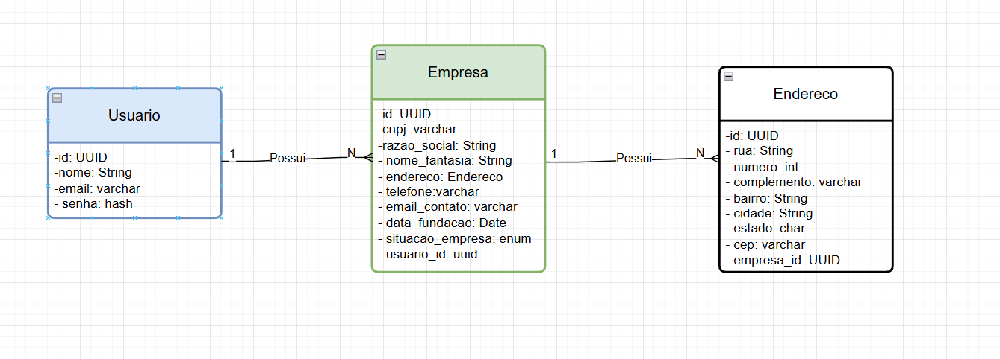
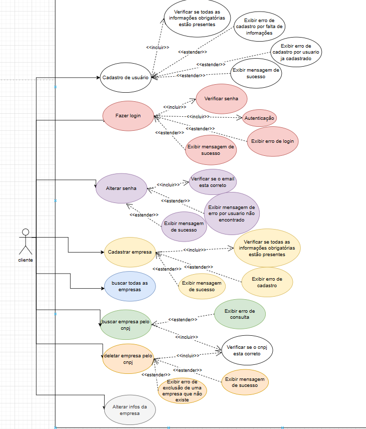

# Projeto de cadastramento de Empresas com banco relacional

Este projeto implementará um **CRUD** onde permitirá o cadastramento de usuários e empresas, autenticação de usuários e também consultas e exclusão de empresas

---

## 📦 Funcionalidades:

- Usuários:
  - Cadastro
  - Login com autenticação
  - Alteração de senha
  
- Empresas:
  - Cadastro 
  - Consultas com suporte a filtros e paginação
  - Alteração de dados
  - Exclusão

---

## 🧠 Arquitetura Aplicada

### ☕ Java – Clean Architecture

- Separação clara entre domain, application, infrastructure e interfaces 

📁 Estrutura:

obs: irá ser escrito no decorrer do desenvolvimento

----

## ⚙️ Tecnologias e pacotes utilizados

- Linguagem: 
  - Java 17.0
- Framework:
  - Spring-Boot 3.5.4
- Dependencias:
  - Spring data JPA
  - Spring Security
  - Spring Web
  - MySQL Driver
  - Lombok
  - Spring Doc
  - Spring JWT
  - Flyway
  - Spring Starter Validation
  - Spring 

---

## Desenhos técnicos:

